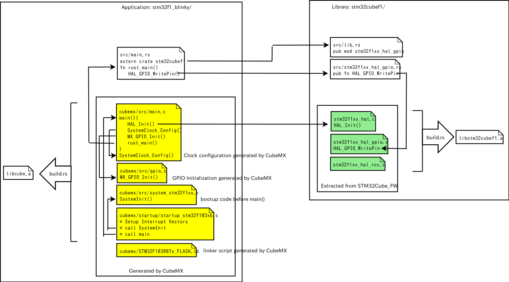
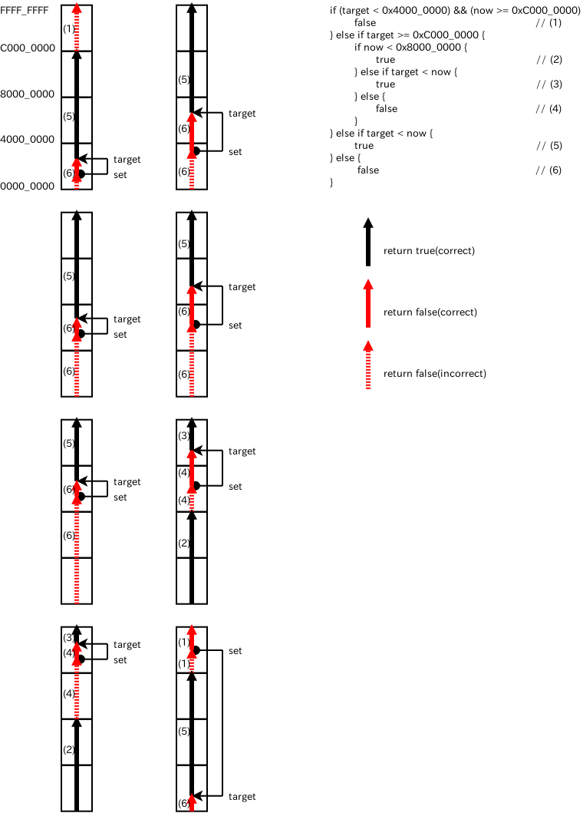
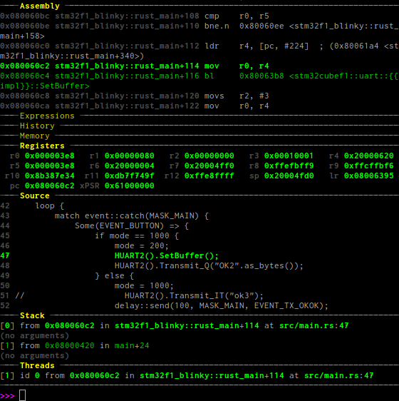
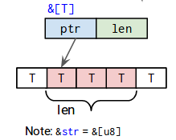

## xargo

```
$ cargo install xargo
```

## make new project

```
$ xargo new stm32f1_blinky --bin
$ cd stm32f1_blinky
```

## install nightly

```
$ rustup install nightly
```

## use nightly toolchain

```
$ rustup override set nightly
```

## minimum main.rs

```
// src/main.rs
#![no_std]
#![no_main]
#![feature(lang_items)]
#![feature(start)]

#[no_mangle]
#[start]
pub extern fn main() {
	loop {}
}

#[lang="panic_fmt"]
pub fn panic_fmt() -> ! { loop {} }

#[lang="eh_personality"]
extern fn eh_personality () {}
```

## .cargo/config

* `.cargo/config`でリンカへのフラグを指定する。
* `./layout.ld`は、(現時点では)CubeMXが生成したものをコピー。

```
[target.thumbv6m-none-eabi]
rustflags = [
    "-C", "link-arg=-Tlayout.ld",
    "-C", "link-arg=-nostartfiles",
]
```

## first build

```
$ xargo build --target thumbv6m-none-eabi --verbose
+ "rustc" "--print" "sysroot"
+ "rustc" "--print" "target-list"
+ "cargo" "build" "--target" "thumbv6m-none-eabi" "--verbose"
   Compiling stm32f1_blinky v0.1.0 (file://$(PROJECTS)/stm32f1_blinky)
     Running `rustc --crate-name stm32f1_blinky src/main.rs --crate-type bin --emit=dep-info,link -C debuginfo=2 -C metadata=a521522334486350 -C extra-filename=-a521522334486350 --out-dir $(PROJECTS)/stm32f1_blinky/target/thumbv6m-none-eabi/debug/deps --target thumbv6m-none-eabi -L dependency=$(PROJECTS)/stm32f1_blinky/target/thumbv6m-none-eabi/debug/deps -L dependency=$(PROJECTS)/stm32f1_blinky/target/debug/deps -C link-arg=-Tlayout.ld -C link-arg=-nostartfiles --sysroot $(HOME)/.xargo`
    Finished dev [unoptimized + debuginfo] target(s) in 0.34 secs
```

うまくリンク出来た。

`.cargo/config`の`[build]`節を書いておけば、`--target` オプションは不要だ。`xargo build`だけで良い。

```
[build]
target = "thumbv6m-none-eabi"

[target.thumbv6m-none-eabi]
rustflags = [
    "-C", "link-arg=-Tcubemx/STM32F103RBTx_FLASH.ld",
    "-C", "link-arg=-nostartfiles",
]

$ xargo build --verbose
```

## startupとリンク

startup(asm)とリンクする⇒クロスビルドが必要⇒build.rsを使う。

### Cargo.toml

`Cargo.toml` の`[package]`セクションに`build="build.rs"`とビルドスクリプトを指定する。

```
[package]
name = "stm32f1_blinky"
version = "0.1.0"
authors = ["KONDO Nobuhiro <kondou.nobuhiro@gmail.com>"]
build = "build.rs"
```

### build.rs

`build.rs`に、クロスビルドの方法を記述する。

```
use std::process::Command;
use std::env;
use std::path::Path;

fn main() {
    let out_dir = env::var("OUT_DIR").unwrap();

    Command::new("arm-none-eabi-as")
        .args(&["-mcpu=cortex-m3", "-mthumb", "-mfloat-abi=soft"])
        .args(&["cubemx/startup/startup_stm32f103xb.s"])
        .args(&["-o"])
        .arg(&format!("{}/startup_stm32f103xb.o", out_dir))
        .status().unwrap();
    Command::new("arm-none-eabi-ar")
        .args(&["crus", "libcube.a", "startup_stm32f103xb.o"])
        .current_dir(&Path::new(&out_dir))
        .status().unwrap();

    println!("cargo:rustc-link-search=native={}", out_dir);
    println!("cargo:rustc-link-lib=static=cube");

    println!("cargo:rerun-if-changed=build.rs");
}
```

* out_dirの場所を抽出する。そのために必要なライブラリを `use`しておく。
* `arm-none-eabi-as`を、引数を指定して実行する。
* `arm-none-eabi-ar`で、オブジェクトをライブラリにまとめる。よくわからないが、たとえ1つであっても、ライブラリにまとめる。
* `rustc-link-lib`キーワードでリンクするライブラリを指定する。
* `build.rs`が修正されたら再ビルドするように指定する。

### .cargo/config

「なぜか」`rustflags`に`-C opt-level=2`を付けないと(デフォルトの opt-level=0だと)リンクエラーになる。さすが Nightly(2017-04-01) だ。

```
[build]
target = "thumbv6m-none-eabi"

[target.thumbv6m-none-eabi]
rustflags = [
    "-Z", "no-landing-pads",
    "-C", "opt-level=2",
    "-C", "link-arg=-mcpu=cortex-m3",
    "-C", "link-arg=-mthumb",
    "-C", "link-arg=-mfloat-abi=soft",
    "-C", "link-arg=-specs=nosys.specs",
    "-C", "link-arg=-specs=nano.specs",
    "-C", "link-arg=-Tcubemx/STM32F103RBTx_FLASH.ld"
]
```

### xargo

```
$ xargo build --verbose
+ "rustc" "--print" "sysroot"
+ "rustc" "--print" "target-list"
+ "cargo" "build" "--release" "--manifest-path" "/tmp/xargo.AEz9iXUSP62q/Cargo.toml" "--target" "thumbv6m-none-eabi" "-v" "-p" "core"
   Compiling core v0.0.0 (file://$(HOME)/.rustup/toolchains/nightly-x86_64-unknown-linux-gnu/lib/rustlib/src/rust/src/libcore)
     Running `rustc --crate-name core $(HOME)/.rustup/toolchains/nightly-x86_64-unknown-linux-gnu/lib/rustlib/src/rust/src/libcore/lib.rs --crate-type lib --emit=dep-info,link -C opt-level=3 -C metadata=757c4ccf137254cc -C extra-filename=-757c4ccf137254cc --out-dir /tmp/xargo.AEz9iXUSP62q/target/thumbv6m-none-eabi/release/deps --target thumbv6m-none-eabi -L dependency=/tmp/xargo.AEz9iXUSP62q/target/thumbv6m-none-eabi/release/deps -L dependency=/tmp/xargo.AEz9iXUSP62q/target/release/deps -Z no-landing-pads -C opt-level=2 -C link-arg=-mcpu=cortex-m3 -C link-arg=-mthumb -C link-arg=-mfloat-abi=soft -C link-arg=-specs=nosys.specs -C link-arg=-specs=nano.specs -C link-arg=-Tcubemx/STM32F103RBTx_FLASH.ld --sysroot $(HOME)/.xargo`
    Finished release [optimized] target(s) in 16.15 secs
+ "cargo" "build" "--verbose"
       Fresh stm32f1_blinky v0.1.0 (file://$(PROJECTS)/stm32f1_blinky)
    Finished dev [unoptimized + debuginfo] target(s) in 0.0 secs
```

`target/thumbv6m-none-eabi/debug/build/deps/`にバイナリができているので OpenOCDで焼く。

```
$ openocd -f board/st_nucleo_f103rb.cfg -c "init" -c "reset init" -c "stm32f1x mass_erase 0" -c "flash write_image target/thumbv6m-none-eabi/debug/deps/stm32f1_blinky-a521522334486350" -c "reset halt" -c "reset run" -c "exit"
Open On-Chip Debugger 0.9.0 (2015-09-02-10:42)
Licensed under GNU GPL v2
For bug reports, read
	http://openocd.org/doc/doxygen/bugs.html
Info : The selected transport took over low-level target control. The results might differ compared to plain JTAG/SWD
adapter speed: 1000 kHz
adapter_nsrst_delay: 100
none separate
srst_only separate srst_nogate srst_open_drain connect_deassert_srst
Info : Unable to match requested speed 1000 kHz, using 950 kHz
Info : Unable to match requested speed 1000 kHz, using 950 kHz
Info : clock speed 950 kHz
Info : STLINK v2 JTAG v27 API v2 SWIM v15 VID 0x0483 PID 0x374B
Info : using stlink api v2
Info : Target voltage: 3.250952
Info : stm32f1x.cpu: hardware has 6 breakpoints, 4 watchpoints
target state: halted
target halted due to debug-request, current mode: Thread 
xPSR: 0x01000000 pc: 0x08000244 msp: 0x20005000
Info : device id = 0x20036410
Info : flash size = 128kbytes
stm32x mass erase complete
target state: halted
target halted due to breakpoint, current mode: Thread 
xPSR: 0x61000000 pc: 0x2000003a msp: 0x20005000
wrote 2092 bytes from file target/thumbv6m-none-eabi/debug/deps/stm32f1_blinky-a521522334486350 in 0.117597s (17.373 KiB/s)
target state: halted
target halted due to debug-request, current mode: Thread 
xPSR: 0x01000000 pc: 0x08000244 msp: 0x20005000
```

リポジトリでは`flash.sh`というシェルスクリプトにしてある。

## ライブラリ化

共通部分を stm32cubef1というようにライブラリ化して、アプリ側では、Rustっぽく書きたい。

### アプリ側

```
stm32f1_blinky
├── cubemx
│   ├── Inc
│   │   ├── gpio.h
│   │   ├── main.h
│   │   ├── stm32f1xx_hal_conf.h
│   │   └── stm32f1xx_it.h
│   ├── STM32F103RBTx_FLASH.ld
│   ├── Src
│   │   ├── gpio.c
│   │   ├── main.c                 main.c::main()から rust_mainを呼ぶ
│   │   ├── stm32f1xx_hal_msp.c
│   │   ├── stm32f1xx_it.c
│   │   ├── system_stm32f1xx.c
│   │   └── systemclock_config.c
│   ├── cubemx.ioc
│   └── startup
│       └── startup_stm32f103xb.s
├── src
│   └── main.rs                    fn rust_main() から始まる
                                       
```

* CubeMX で生成。
* CubeMX で生成した設定が、main() の前半で有効になる。
* CubeMX で生成した main.c のなかの main() から rust_main()を呼ぶ。
* src/main.rs の rust_main が RUST 側のエントリーポイント。
* Cargo.toml でライブラリを呼ぶ。
```
[dependencies]
stm32cubef1 = {path = "../stm32cubef1"}
```

`src/main.rs`はこんな感じ。

```
#![no_std]
#![no_main]
#![feature(lang_items)]
#![feature(asm)]

extern crate stm32cubef1;
use stm32cubef1::*;
use stm32f1xx_hal_gpio::{GPIOA, GPIO_PIN_5};

#[no_mangle]
pub extern fn rust_main() {
    stm32f1xx_hal_gpio::GPIOA_CLK_ENABLE();

    let mut gpio_init_struct = stm32f1xx_hal_gpio::GPIO_InitTypeDef{Pin: 0, Mode: 0, Pull: 0, Speed: 0};
    gpio_init_struct.Pin = 0x0020;
    gpio_init_struct.Mode = 0x0001;
    gpio_init_struct.Speed = 0x0002;

    stm32f1xx_hal_gpio::Init(GPIOA(), &gpio_init_struct);

    loop {
        stm32f1xx_hal_gpio::WritePin(GPIOA(), GPIO_PIN_5, 1);
        for _ in 1..400000 {
            unsafe {
                asm!("");
            }
        }

        stm32f1xx_hal_gpio::WritePin(GPIOA(), GPIO_PIN_5, 0);
        for _ in 1..400000 {
            unsafe {
                asm!("");
            }
        }
    }
}

#[lang="panic_fmt"]
pub fn panic_fmt() -> ! {
    loop {}
}

#[lang="eh_personality"]
extern "C" fn eh_personality() {}
```
ネームスペースを活用すれば、次のようにすっきりと書ける。
```
#![no_std]
#![no_main]
#![feature(lang_items)]
#![allow(non_snake_case)]

extern crate stm32cubef1;
use stm32cubef1::*;
use gpio;
use gpio::{GPIOA};

#[no_mangle]
pub extern fn rust_main() {
/*
    // GPIOA::PIN_5 == LD2
    // GPIOA_5 is configured as Output_pp in gpio.c:MX_GPIO_Init()
    // ,which is generated by CubeMX
    GPIOA().Init(&gpio::InitTypeDef{
            Pin: gpio::PIN_5 as u32,
            Mode: gpio::MODE_OUTPUT_PP,
            Pull: gpio::NOPULL,
            Speed: gpio::SPEED_FREQ_LOW});
*/
}

static mut COUNT :u32 = 0;
static mut MODE :u32 = 1000;

#[no_mangle]
pub extern fn HAL_SYSTICK_Callback() {
    unsafe {  // static mut を取り扱うのは unsafe になる -> BAD!!!
        COUNT = COUNT + 1;
        if COUNT == MODE {
            GPIOA().WritePin(gpio::PIN_5, 1);
        }
        if COUNT > (2*MODE) {
            GPIOA().WritePin(gpio::PIN_5, 0);
            COUNT = 0;
        }
    }
}

#[no_mangle]
pub extern fn HAL_GPIO_EXTI_Callback(gpio_pin: u16) {
    if gpio_pin == gpio::PIN_13 {
        unsafe {
            if MODE == 1000 {
                MODE = 200;
            } else {
                MODE = 1000;
            }
        }
    }
}


#[lang="panic_fmt"]
pub fn panic_fmt() -> ! {
    loop {}
}

#[lang="eh_personality"]
extern "C" fn eh_personality() {}
```
だいぶ Rust っぽい。

* `GIPOA.Init(...)`は C API の `GPIO_Init(GPIOA, GPIO_InitTypeDef)`に対応する。
  + レジスタの集合体である GPIO::TypeDef のトレイトとして Init API を定義することで、オブジェクト指向っぽく書ける。
  + GPIOA は GPIO::TypeDef のアドレスを指定したインスタンス。
  + 実用上は、CubeMXが生成した gpio.c:MX_GPIO_Init()内でポートの設定が行われる。このような初期化コードは、ほとんどの場合で不要だ。
* `GPIOA().Write(pin)`も、同様に`GPIO_Write(GPIOA,GPIO_Pin)`に対応する。
* `HAL_SYSTICK_Callback()`,`HAL_GPIO_EXTI_Callback()`は、C API のコールバック。
  + `#[no_mangle]`で C から呼び出せるように mangling(名前修飾)をしない。
  + C API では `__weak` symbol として定義されているので、Rustで定義して上書きリンクすれば良い。
* グローバル化変数の修正は `unsafe`操作となる。
  + 大文字の変数名を要求される。
  + 次に改善予定。

これで、1000ms 間隔で点滅しているLED が、ボタンを押すと 200ms 間隔に変化する。

### ライブラリ側

* `STM32Cube_FW`を展開してビルドする。
* CubeMXが生成する`stm32f1xx_hal_conf.h`が必要になるので、どっかから持ってきておく。
* `src/lib.rs` をエントリーポイントにして、ラッパーインタフェースを書く。



## イベントの送受信

割り込み側とアプリ側で情報をやり取りするのに、グローバル変数ではあまりにも危険だ。Rustの保護機構も働かず、`unsafe`だらけのコードになってしまう。簡単なイベント機構を作って、安全にやり取りできるようにしたい。

```
@startuml

hide footbox
participant sender
participant event_queue
participant recv1
participant recv2

sender -> event_queue : send(recv1, event)
activate event_queue
recv2 -> event_queue : catch()
event_queue -> recv2 : None
note right : maskが合致しないといけない
recv1 -> event_queue : catch()
event_queue -> recv1 : Some(event)
deactivate event_queue

sender -> event_queue : send(recv1|recv2, event)
activate event_queue
recv2 -> event_queue : catch()
event_queue -> recv2 : Some(event)
note right : 複数宛先があるときは\n全部の受領者が受け取るまでキューに残る
recv1 -> event_queue : catch()
event_queue -> recv1 : Some(event)
deactivate event_queue

@enduml
```

### lock.rs

排他制御のための簡単なコード。マニュアルでは `core::sync::atomic::AtomicBool`が使えそうなのだが、現時点ではうまく使えていない。[cortex-m3(thumbv6m)では Atomic 命令が無いから使えないっぽい](https://github.com/rust-lang-nursery/compiler-builtins/issues/114)。

```
pub enum Lock {
    Locked,
    Unlocked,
}

impl Lock {
    pub fn get_lock(&mut self) -> () {
        loop {
            match *self {
                Lock::Locked => continue,
                _ => {
                    *self = Lock::Locked;
                    break;
                }
            }
        }
    }
    pub fn unlock(&mut self) -> () {
        *self = Lock::Unlocked;
    }
}
```

### event.rs

event.rs の中で lock.rs を使う。そのためには、トップレベルの `main.rs`で `mod`宣言が必要。

もう少し上手いやり方があってもいいと思う。

```
// main.rs
mod lock;   // event.rs のために、トップレベル(main.rs)で mod lock; を呼ばなければならない。
mod event;
```
```
// event.rs
use lock::Lock;

const QUEUE_LENGTH: usize = 32;

struct Queue {
    q: [u32; QUEUE_LENGTH],
    length: usize,
    lock: Lock,
}

static mut QUEUE: Queue = Queue {
    q: [0; QUEUE_LENGTH],
    length: 0,
    lock: Lock::Unlocked,
};

impl Queue {
    fn push(&mut self, obj: u32) -> bool {
        if self.length >= QUEUE_LENGTH - 1 {
            false
        } else {
            self.lock.get_lock();
            // これが無ければビルドエラー(`abort`リンクエラー)
            if self.length < QUEUE_LENGTH {
                self.q[self.length] = obj;
            }
            self.length += 1;
            self.lock.unlock();
            true
        }
    }

    fn pop_match_first(&mut self, mask: u32) -> Option<u32> {
        if self.length == 0 {
            None
        } else if self.length > QUEUE_LENGTH {
            None
        } else {
            self.lock.get_lock();
            for i in 0..self.length {
                // これが無ければビルドエラー(`abort`リンクエラー)
                // i < self.length <= QUEUE_LENGTH は見てない? static mut だから?
                if i < QUEUE_LENGTH {
                    // マッチした時は、イベントを消す。
                    if (self.q[i] & 0xffff0000) == (mask & 0xffff0000) {
                        let ret = self.q[i] & 0x0000ffff;
                        if i < self.length {    // キューを詰める
                            for j in (i + 1)..self.length {
                                if (0 < j) && (j < QUEUE_LENGTH) {
                                    self.q[j - 1] = self.q[j];
                                }
                            }
                        }
                        self.length -= 1;
                        self.lock.unlock();
                        return Some(ret);

                    // そうで無ければ、フラグを落とす。
                    } else if (self.q[i] & mask) != 0 {
                        let ret = self.q[i] & 0x0000ffff;
                        self.q[i] = self.q[i] & !mask;
                        self.lock.unlock();
                        return Some(ret);
                    }
                }
            }
            self.lock.unlock();
            None // 見つからなかった
        }
    }
}


/// イベントを受信する。
/// キューに溜まっているイベントをスキャンして、
/// マスク部を OR して not 0 ならイベント有り。Some(イベント)を返す。
/// マッチするイベントがなければ None を返す。
pub fn catch(mask: u32) -> Option<u32> {
    unsafe { QUEUE.pop_match_first(mask) }
}


/// 宛先を指定せずにイベントを送る。
/// 上位16bitはマスク、下位16bitはイベント値。
pub fn send(mask: u32, event: u32) -> () {
    let obj = (mask & 0xffff0000) | (event & 0x0000ffff);
    unsafe {
        QUEUE.push(obj);
    }
}
```

* queue の実装とうまく分離できていない。
* `#![no_std]`環境だと `vec`が使えないので、自前で実装する。
* バカサーチなので効率は悪い。
* 配列をスキャンするとき、オーバーランしそうなコードだと、チェック＆アボートのコードが挿入されるのか、`abort()`がない、というリンクエラーとなる。Rustっぽい。

`main.rs`は次のとおり。

```
#![no_std]
#![no_main]
#![feature(lang_items)]
#![allow(non_snake_case)]

extern crate stm32cubef1;
use stm32cubef1::*;
use gpio;
use gpio::GPIOA;
use pwr;

mod lock;   // event.rs のために、トップレベル(main.rs)で mod lock; を呼ばなければならない。
mod event;

static mut COUNT: u32 = 0;
static mut MODE: u32 = 1000;

const MASK_MAIN: u32 = 0x00010000;
const EVENT_BUTTON: u32 = 0x0001;

#[no_mangle]
pub extern "C" fn rust_main() {
    let mut mode = 1000;
    loop {
        // if let 構文を使う。
        if let Some(EVENT_BUTTON) = event::catch(MASK_MAIN) {
            if mode == 1000 {
                mode = 500;
            } else {
                mode = 1000;
            }
        }

        unsafe {MODE = mode;}

        pwr::EnterSLEEPMode(pwr::SLEEPENTRY_WFI);
    }

}

#[no_mangle]
pub extern "C" fn HAL_SYSTICK_Callback() {
    unsafe {
        COUNT += 1;
        if COUNT == MODE {
            GPIOA().WritePin(gpio::PIN_5, gpio::Level::High);
        }
        if COUNT > (2 * MODE) {
            GPIOA().WritePin(gpio::PIN_5, gpio::Level::Low);
            COUNT = 0;
        }
    }
}

#[no_mangle]
pub extern "C" fn HAL_GPIO_EXTI_Callback(gpio_pin: u16) {
    if gpio_pin == gpio::PIN_13 {
        event::send(MASK_MAIN, EVENT_BUTTON);
    }
}
```
* まだまだ、`HAL_SYSTICK_Callback()`でグローバル化変数を使っている。
* `rust_main()`はすっきりしてきた。
* ついでに、`if let`構文を使ってみた。

### delay.rs

`HAL_SYSTICK_Callback()`でいろいろな、具体的作業をしているのは好ましくない。遅延イベントを実装して、SysTickは、それをハンドリングさせる。

今の実装は、非常に効率が悪い。sort すればだいぶマシになるだろう。

```
use lock::Lock;
use hal;

const QUEUE_LENGTH: usize = 32;

#[derive(Clone,Copy)]
struct Event {
    tick: u32,
    ev: u32,
}

struct Queue {
    q: [Event; QUEUE_LENGTH],
    length: usize,
    lock: Lock,
}

static mut QUEUE: Queue = Queue {
    q: [Event{tick:0,ev:0}; QUEUE_LENGTH],
    length: 0,
    lock: Lock::Unlocked,
};

impl Queue {
    fn push(&mut self, obj: Event) -> bool {
        if self.length >= QUEUE_LENGTH - 1 {
            false
        } else {
            self.lock.get_lock();
            // これが無ければビルドエラー(`abort`リンクエラー)
            if self.length < QUEUE_LENGTH {
                self.q[self.length] = obj;
            }
            self.length += 1;
            self.lock.unlock();
            true
        }
    }

    fn pop_after(&mut self, time: u32) -> Option<u32> {
        if self.length == 0 {
            None
        } else if self.length > QUEUE_LENGTH {
            None
        } else {
            self.lock.get_lock();
            for i in 0..self.length {
                // これが無ければビルドエラー(`abort`リンクエラー)
                // i < self.length <= QUEUE_LENGTH は見てない? static mut だから?
                if i < QUEUE_LENGTH {
                    if self.q[i].tick <= time {
                        let ret = self.q[i].ev;
                        if i < self.length {
                            for j in (i + 1)..self.length {
                                if (0 < j) && (j < QUEUE_LENGTH) {
                                    self.q[j - 1] = self.q[j];
                                }
                            }
                        }
                        self.length -= 1;
                        self.lock.unlock();
                        return Some(ret);
                    }
                }
            }
            self.lock.unlock();
            None // 見つからなかった
        }
    }
}

/// キューに溜まっているイベントをスキャンして、
/// time(通常は現在時刻 `hal::GetTick()`が渡される)が超過していたらイベント有り。Some(イベント)を返す。
/// マッチするイベントがなければ None を返す。
pub fn check_event(time: u32) -> Option<u32> {
    unsafe { QUEUE.pop_after(time) }
}


/// delay[ms]後に向かってイベントを送る
pub fn send(delay: u32, mask: u32, event :u32) -> () {
    let obj = (mask & 0xffff0000) | (event & 0x0000ffff);
    unsafe {
        QUEUE.push(Event{tick: delay + hal::GetTick(), ev:obj});
    }
}
```

これを使えば、`main.rs`はこうなる。
```
#![no_std]
#![no_main]
#![feature(lang_items)]
#![allow(non_snake_case)]

extern crate stm32cubef1;
use stm32cubef1::*;
use gpio;
use gpio::GPIOA;
use pwr;
use hal;

mod lock;   // event.rs のために、トップレベル(main.rs)で mod lock; を呼ばなければならない。
mod event;
mod delay;

const MASK_MAIN: u32 = 0x00010000;
const EVENT_BUTTON: u32 = 0x0001;
const EVENT_LED_ON: u32 = 0x0002;
const EVENT_LED_OFF: u32 = 0x0003;

#[no_mangle]
pub extern "C" fn rust_main() {
    let mut mode = 1000;

    GPIOA().WritePin(gpio::PIN_5, gpio::Level::High);
    delay::send(mode, MASK_MAIN, EVENT_LED_OFF);

    loop {
        match event::catch(MASK_MAIN) {
            Some(EVENT_BUTTON) => {
                if mode == 1000 {
                    mode = 200;
                } else {
                    mode = 1000;
                }
            },
            Some(EVENT_LED_ON) => {
                GPIOA().WritePin(gpio::PIN_5, gpio::Level::High);
                delay::send(mode, MASK_MAIN, EVENT_LED_OFF);
            },
            Some(EVENT_LED_OFF) => {
                GPIOA().WritePin(gpio::PIN_5, gpio::Level::Low);
                delay::send(mode, MASK_MAIN, EVENT_LED_ON);
            },
            _ => {},
        }

        pwr::EnterSLEEPMode(pwr::SLEEPENTRY_WFI);
    }

}

#[no_mangle]
pub extern "C" fn HAL_SYSTICK_Callback() {
    if let Some(ev) = delay::check_event(hal::GetTick()) {
        event::send(ev,ev);
    }
}

#[no_mangle]
pub extern "C" fn HAL_GPIO_EXTI_Callback(gpio_pin: u16) {
    if gpio_pin == gpio::PIN_13 {
        event::send(MASK_MAIN, EVENT_BUTTON);
    }
}
```
* `main.rs`から `unsafe`が消えた。
  + `event.rs`、`delay.rs`はグローバルにひとつのキューを持つので、そこは`unsafe`が必要。
  + 外部からは隠蔽されている。
* `HAL_SYSTICK_Callback()`は`delay.rs`に置きたかったのだが、うまく行かない。
* イベントが const で実装されていて美しくない。Enum にしたいね。
* `delay.rs`は、SysTickのオーバーフローを考慮できていない。
  + このままでは、1[ms]*2^32=49.7[day]後に誤動作する。昔のWindowsみたいだ。
  + 比較方法を改良すれば対応できるが、今はサボっている。

### is_after()

オーバーフローを前提とした前後判別ルーチンとして、delay＜0xC000_0000 という実用上あまり問題にならない条件を付けることで便利に使える、次のものを使っている。

```
fn is_after(target:u32, now:u32) -> bool {
    if (target < 0x4000_0000) && (now >= 0xc000_0000) {
        false
    } else if target >= 0xc000_0000 {
        if now < 0x8000_0000 {
            true
        } else if target < now {
            true
        } else {
            false
        }
    } else if target < now {
        true
    } else {
        false
    }
}
```


## UART の送受信

ライブラリで HAL UART のラッパを作ったので、UART 通信ができる。

Nucleo ボードは、USART2 の端子が ST-Link とつながっている。それが、PC側からは USB上の UART と見える。Linux からだと gtkterm などで /dev/ttyACM0 にアクセスすれば良い。

```
extern {
    static mut huart2 : uart::HandleTypeDef;
}

pub fn HUART2() -> &'static mut uart::HandleTypeDef {
    unsafe { &mut huart2 }
}
```
と、CubeMXが生成した usart.c 内で確保されているハンドル構造体への参照を作っておいて、次のように書き込む。
直接 `huart2`へアクセスしても良いが、そのたびに `unsafe`が必要になる。一旦参照を返す関数を通し、そこで`unsafe`するようにした。
```
     HUART2().Transmit_IT(send_str);
```

どのみち、HALが提供する `UART_HandleTypeDef`ベースのAPIは問題が多く、自作しなおした方が良さそうだ。


## gdb-dashboard

Rust でビジュアルにデバッグする方法として VS-Code を使うやり方については、すでに述べた。[https://github.com/nkon/rust_blinky#vs-code-%E3%81%A7%E3%81%AE%E3%83%87%E3%83%90%E3%83%83%E3%82%B0]()

別の方法として、gdb-dashboard を使う方法がある。

* gdb-dashboard をダウンロードして ./.gdbinit に保存する[https://github.com/cyrus-and/gdb-dashboard]()。
* 別の端末で OpenOCD を起動しておく。
```
$ openocd -f board/st_nucleo_f103rb.cfg
```
* 通常どおり gdb を起動して、`source .gdbinit`する。⇒プロンプトが`>>>`に変わる。
```
$ arm-none-eabi-gdb target/thumbv6m-none-eabi/debug/stm32f1_blinky
GNU gdb (7.10-1ubuntu3+9) 7.10
〜〜〜〜〜起動メッセージ〜〜〜〜〜
(gdb) source .gdbinit
>>> 
```
* openocd と接続する。
```
>>> target remote localhost:3333
Remote debugging using localhost:3333
stm32f1_blinky::rust_main () at src/main.rs:47
47	                    HUART2().SetBuffer();
─── Assembly ───────────────────────────────────────────────────────────────────
0x080060bc stm32f1_blinky::rust_main+108 cmp	r0, r5
0x080060be stm32f1_blinky::rust_main+110 bne.n	0x80060ee <stm32f1_blinky::rust_main+158>
0x080060c0 stm32f1_blinky::rust_main+112 ldr	r4, [pc, #224]	; (0x80061a4 <stm32f1_blinky::rust_main+340>)
0x080060c2 stm32f1_blinky::rust_main+114 mov	r0, r4
0x080060c4 stm32f1_blinky::rust_main+116 bl	0x80063b8 <stm32cubef1::uart::{{impl}}::SetBuffer>
0x080060c8 stm32f1_blinky::rust_main+120 movs	r2, #3
0x080060ca stm32f1_blinky::rust_main+122 mov	r0, r4
─── Expressions ────────────────────────────────────────────────────────────────
─── History ────────────────────────────────────────────────────────────────────
─── Memory ─────────────────────────────────────────────────────────────────────
─── Registers ──────────────────────────────────────────────────────────────────
  r0 0x000003e8   r1 0x00000080   r2 0x00000000   r3 0x00010001   r4 0x20000620
  r5 0x000003e8   r6 0x20000004   r7 0x20004ff0   r8 0xffefbff9   r9 0xffcffbf6
 r10 0x8b387e34  r11 0xdb7f749f  r12 0xffe8ffff   sp 0x20004fd0   lr 0x08006395
  pc 0x080060c2 xPSR 0x61000000
─── Source ─────────────────────────────────────────────────────────────────────
42     loop {
43         match event::catch(MASK_MAIN) {
44             Some(EVENT_BUTTON) => {
45                 if mode == 1000 {
46                     mode = 200;
47                     HUART2().SetBuffer();
48                     HUART2().Transmit_Q("OK2".as_bytes());
49                 } else {
50                     mode = 1000;
51 //                    HUART2().Transmit_IT("ok3");
52                     delay::send(100, MASK_MAIN, EVENT_TX_OKOK);
─── Stack ──────────────────────────────────────────────────────────────────────
[0] from 0x080060c2 in stm32f1_blinky::rust_main+114 at src/main.rs:47
(no arguments)
[1] from 0x08000420 in main+24
(no arguments)
─── Threads ────────────────────────────────────────────────────────────────────
[1] id 0 from 0x080060c2 in stm32f1_blinky::rust_main+114 at src/main.rs:47
────────────────────────────────────────────────────────────────────────────────
>>> 
```
* あとは、通常の gdb コマンドが使える。
* MCU のレジスタが見れるのが便利。
* シンタックスハイライトで `#???`が見にくい時は、`.gdbinit`で、syntax_hiliging が `'vim'`になっているところを`''`にすれば良い。
* メモリを見るには `dashboard memory watch 0x20000620 40`など。引数は、開始アドレス、長さ。変数名(補完が効く)でも指定できる。表示スタイルは `.gdbinit`の`Memory::format_memory`でハードコードされているので、変更するにはオーバライドしてやる。
* スタックの表示を増やすには `dashboard stack -style limit 15`など。



## 構造体とスライス

HAL_Uart には、次の構造体が使われる。

``` 
typedef struct
{
  USART_TypeDef                 *Instance;        /*!< UART registers base address        */
  UART_InitTypeDef              Init;             /*!< UART communication parameters      */
  uint8_t                       *pTxBuffPtr;      /*!< Pointer to UART Tx transfer Buffer */
  uint16_t                      TxXferSize;       /*!< UART Tx Transfer size              */
  uint16_t                      TxXferCount;      /*!< UART Tx Transfer Counter           */
  uint8_t                       *pRxBuffPtr;      /*!< Pointer to UART Rx transfer Buffer */
  uint16_t                      RxXferSize;       /*!< UART Rx Transfer size              */
  uint16_t                      RxXferCount;      /*!< UART Rx Transfer Counter           */  
  DMA_HandleTypeDef             *hdmatx;          /*!< UART Tx DMA Handle parameters      */
  DMA_HandleTypeDef             *hdmarx;          /*!< UART Rx DMA Handle parameters      */
  HAL_LockTypeDef               Lock;             /*!< Locking object                     */
  __IO HAL_UART_StateTypeDef    State;            /*!< UART communication state           */
  __IO uint32_t                 ErrorCode;        /*!< UART Error code                    */
}UART_HandleTypeDef;
```

* `USART_TypeDef`は、ペリフェラルのレジスタへのポインタ。
* `UART_InitTypeDef`は、ペリフェラルの初期設定値。
* `HAL_LockTypeDef`は `enum`だが、調べてみると `u8`のサイズだった。
* `HAL_UART_StateTypeDef`は `enum`だが、調べてみると `u8`のサイズだった。
* `*pTxBuffPtr`、`*pRxBuffPtr`は、バッファへのポインタである。

こいつに Rust からアクセスするための構造体を定義する。

```
#[repr(C)]
pub struct Regs {
    SR: u32, /* USART Status register */
    DR: u32, /* USART Data register */
    BRR: u32, /* USART Baud rate register */
    CR1: u32, /* USART Control register 1 */
    CR2: u32, /* USART Control register 2 */
    CR3: u32, /* USART Control register 3 */
    BTPR: u32, /* USART Guard time and prescaler register */
}
```
いつものレジスタバンク構造体。

```
#[repr(C)]
#[derive(Clone)]
pub struct Init {
    BaudRate: u32,
    WordLength: u32,
    StopBits: u32,
    Parity: u32,
    Mode: u32,
    HwFlowCtl: u32,
    OverSampling: u32,
}
```
CubeMXがペリフェラルを初期化するのに使う構造体。CubeMXが初期化したのをコピーすると便利なので、`#[derive(Clone)]`も付けておく。

```
#[repr(C)]
pub struct Handle {
    Instance: &'static mut Regs,
    pub Init: Init,
    pTxBuffPtr: *mut u8,
    TxXferSize: u16,
    TxXferCount:u16,
    pRxBuffPtr: *mut u8,
    RxXferSize: u16,
    RxXferCount: u16,
    hdmatx: u32,
    hdmarx: u32,
    Lock: u8,
    State: u8,
    errorCode: u32,
}
```

ここで注意すべきなのは、pTxBuffPtr(pRxBuffPtrも)がスライス(`&mut[u8]`)ではなく、生ポインタ(`*mut u8`)であること。スライスは、ポインタだけでなく領域の長さを管理するための領域を持つので、構造体に入れると配置がずれる⇒[Rust container cheat sheet](https://docs.google.com/presentation/d/1q-c7UAyrUlM-eZyTo1pd8SZ0qwA_wYxmPZVOQkoDmH4/edit#slide=id.p)。

たまたまなのだが、スライスはポインタ(32bit)+サイズ(32bit)なので、`TxXferSize`が`u32`なら、うまく兼用出来たかもしれない。もしくは、バイトオーダを考慮して`TxXferCount`→`TxXferSize`の順か。面倒を見きれるなら、HALの構造体を修正しても良い。



Rustのポインタは、+/- の演算が出来ないので、スライスの途中にコピーしたいときは、補助関数が必要になる。とっても `unsafe`でダーティな領域だ。

```
void memcpy_offset(unsigned char *dst, const unsigned char *src, unsigned char len, unsigned char offset)
{
  while(len--){
    *(dst+offset) = *src;
    dst++;
    src++;
  }
}
```


# lazy static
# queue 実装の共用
+ static mut の初期化
+ Syncが否定実装されている