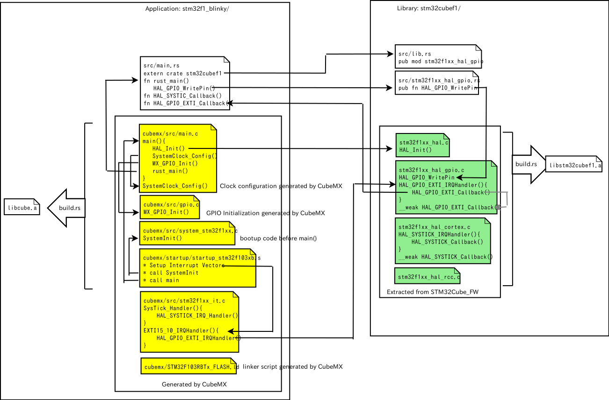

## xargo

```
$ cargo install xargo
```

## make new project

```
$ xargo new stm32f1_blinky --bin
$ cd stm32f1_blinky
```

## install nightly

```
$ rustup install nightly
```

## use nightly toolchain

```
$ rustup override set nightly
```

## minimum main.rs

```
// src/main.rs
#![no_std]
#![no_main]
#![feature(lang_items)]
#![feature(start)]

#[no_mangle]
#[start]
pub extern fn main() {
	loop {}
}

#[lang="panic_fmt"]
pub fn panic_fmt() -> ! { loop {} }

#[lang="eh_personality"]
extern fn eh_personality () {}
```

## .cargo/config

* `.cargo/config`でリンカへのフラグを指定する。
* `./layout.ld`は、(現時点では)CubeMXが生成したものをコピー。

```
[target.thumbv6m-none-eabi]
rustflags = [
    "-C", "link-arg=-Tlayout.ld",
    "-C", "link-arg=-nostartfiles",
]
```

## first build

```
$ xargo build --target thumbv6m-none-eabi --verbose
+ "rustc" "--print" "sysroot"
+ "rustc" "--print" "target-list"
+ "cargo" "build" "--target" "thumbv6m-none-eabi" "--verbose"
   Compiling stm32f1_blinky v0.1.0 (file://$(PROJECTS)/stm32f1_blinky)
     Running `rustc --crate-name stm32f1_blinky src/main.rs --crate-type bin --emit=dep-info,link -C debuginfo=2 -C metadata=a521522334486350 -C extra-filename=-a521522334486350 --out-dir $(PROJECTS)/stm32f1_blinky/target/thumbv6m-none-eabi/debug/deps --target thumbv6m-none-eabi -L dependency=$(PROJECTS)/stm32f1_blinky/target/thumbv6m-none-eabi/debug/deps -L dependency=$(PROJECTS)/stm32f1_blinky/target/debug/deps -C link-arg=-Tlayout.ld -C link-arg=-nostartfiles --sysroot $(HOME)/.xargo`
    Finished dev [unoptimized + debuginfo] target(s) in 0.34 secs
```

うまくリンク出来た。

`.cargo/config`の`[build]`節を書いておけば、`--target` オプションは不要だ。`xargo build`だけで良い。

```
[build]
target = "thumbv6m-none-eabi"

[target.thumbv6m-none-eabi]
rustflags = [
    "-C", "link-arg=-Tcubemx/STM32F103RBTx_FLASH.ld",
    "-C", "link-arg=-nostartfiles",
]

$ xargo build --verbose
```

## startupとリンク

startup(asm)とリンクする⇒クロスビルドが必要⇒build.rsを使う。

### Cargo.toml

`Cargo.toml` の`[package]`セクションに`build="build.rs"`とビルドスクリプトを指定する。

```
[package]
name = "stm32f1_blinky"
version = "0.1.0"
authors = ["KONDO Nobuhiro <kondou.nobuhiro@gmail.com>"]
build = "build.rs"
```

### build.rs

`build.rs`に、クロスビルドの方法を記述する。

```
use std::process::Command;
use std::env;
use std::path::Path;

fn main() {
    let out_dir = env::var("OUT_DIR").unwrap();

    Command::new("arm-none-eabi-as")
        .args(&["-mcpu=cortex-m3", "-mthumb", "-mfloat-abi=soft"])
        .args(&["cubemx/startup/startup_stm32f103xb.s"])
        .args(&["-o"])
        .arg(&format!("{}/startup_stm32f103xb.o", out_dir))
        .status().unwrap();
    Command::new("arm-none-eabi-ar")
        .args(&["crus", "libcube.a", "startup_stm32f103xb.o"])
        .current_dir(&Path::new(&out_dir))
        .status().unwrap();

    println!("cargo:rustc-link-search=native={}", out_dir);
    println!("cargo:rustc-link-lib=static=cube");

    println!("cargo:rerun-if-changed=build.rs");
}
```

* out_dirの場所を抽出する。そのために必要なライブラリを `use`しておく。
* `arm-none-eabi-as`を、引数を指定して実行する。
* `arm-none-eabi-ar`で、オブジェクトをライブラリにまとめる。よくわからないが、たとえ1つであっても、ライブラリにまとめる。
* `rustc-link-lib`キーワードでリンクするライブラリを指定する。
* `build.rs`が修正されたら再ビルドするように指定する。

### .cargo/config

「なぜか」`rustflags`に`-C opt-level=2`を付けないと(デフォルトの opt-level=0だと)リンクエラーになる。さすが Nightly(2017-04-01) だ。

```
[build]
target = "thumbv6m-none-eabi"

[target.thumbv6m-none-eabi]
rustflags = [
    "-Z", "no-landing-pads",
    "-C", "opt-level=2",
    "-C", "link-arg=-mcpu=cortex-m3",
    "-C", "link-arg=-mthumb",
    "-C", "link-arg=-mfloat-abi=soft",
    "-C", "link-arg=-specs=nosys.specs",
    "-C", "link-arg=-specs=nano.specs",
    "-C", "link-arg=-Tcubemx/STM32F103RBTx_FLASH.ld"
]
```

### xargo

```
$ xargo build --verbose
+ "rustc" "--print" "sysroot"
+ "rustc" "--print" "target-list"
+ "cargo" "build" "--release" "--manifest-path" "/tmp/xargo.AEz9iXUSP62q/Cargo.toml" "--target" "thumbv6m-none-eabi" "-v" "-p" "core"
   Compiling core v0.0.0 (file://$(HOME)/.rustup/toolchains/nightly-x86_64-unknown-linux-gnu/lib/rustlib/src/rust/src/libcore)
     Running `rustc --crate-name core $(HOME)/.rustup/toolchains/nightly-x86_64-unknown-linux-gnu/lib/rustlib/src/rust/src/libcore/lib.rs --crate-type lib --emit=dep-info,link -C opt-level=3 -C metadata=757c4ccf137254cc -C extra-filename=-757c4ccf137254cc --out-dir /tmp/xargo.AEz9iXUSP62q/target/thumbv6m-none-eabi/release/deps --target thumbv6m-none-eabi -L dependency=/tmp/xargo.AEz9iXUSP62q/target/thumbv6m-none-eabi/release/deps -L dependency=/tmp/xargo.AEz9iXUSP62q/target/release/deps -Z no-landing-pads -C opt-level=2 -C link-arg=-mcpu=cortex-m3 -C link-arg=-mthumb -C link-arg=-mfloat-abi=soft -C link-arg=-specs=nosys.specs -C link-arg=-specs=nano.specs -C link-arg=-Tcubemx/STM32F103RBTx_FLASH.ld --sysroot $(HOME)/.xargo`
    Finished release [optimized] target(s) in 16.15 secs
+ "cargo" "build" "--verbose"
       Fresh stm32f1_blinky v0.1.0 (file://$(PROJECTS)/stm32f1_blinky)
    Finished dev [unoptimized + debuginfo] target(s) in 0.0 secs
```

`target/thumbv6m-none-eabi/debug/build/deps/`にバイナリができているので OpenOCDで焼く。

```
$ openocd -f board/st_nucleo_f103rb.cfg -c "init" -c "reset init" -c "stm32f1x mass_erase 0" -c "flash write_image target/thumbv6m-none-eabi/debug/deps/stm32f1_blinky-a521522334486350" -c "reset halt" -c "reset run" -c "exit"
Open On-Chip Debugger 0.9.0 (2015-09-02-10:42)
Licensed under GNU GPL v2
For bug reports, read
	http://openocd.org/doc/doxygen/bugs.html
Info : The selected transport took over low-level target control. The results might differ compared to plain JTAG/SWD
adapter speed: 1000 kHz
adapter_nsrst_delay: 100
none separate
srst_only separate srst_nogate srst_open_drain connect_deassert_srst
Info : Unable to match requested speed 1000 kHz, using 950 kHz
Info : Unable to match requested speed 1000 kHz, using 950 kHz
Info : clock speed 950 kHz
Info : STLINK v2 JTAG v27 API v2 SWIM v15 VID 0x0483 PID 0x374B
Info : using stlink api v2
Info : Target voltage: 3.250952
Info : stm32f1x.cpu: hardware has 6 breakpoints, 4 watchpoints
target state: halted
target halted due to debug-request, current mode: Thread 
xPSR: 0x01000000 pc: 0x08000244 msp: 0x20005000
Info : device id = 0x20036410
Info : flash size = 128kbytes
stm32x mass erase complete
target state: halted
target halted due to breakpoint, current mode: Thread 
xPSR: 0x61000000 pc: 0x2000003a msp: 0x20005000
wrote 2092 bytes from file target/thumbv6m-none-eabi/debug/deps/stm32f1_blinky-a521522334486350 in 0.117597s (17.373 KiB/s)
target state: halted
target halted due to debug-request, current mode: Thread 
xPSR: 0x01000000 pc: 0x08000244 msp: 0x20005000
```

## ライブラリ化

共通部分を stm32cubef1というようにライブラリ化して、アプリ側では、Rustっぽく書きたい。

### アプリ側

```
stm32f1_blinky
├── cubemx
│   ├── Inc
│   │   ├── gpio.h
│   │   ├── main.h
│   │   ├── stm32f1xx_hal_conf.h
│   │   └── stm32f1xx_it.h
│   ├── STM32F103RBTx_FLASH.ld
│   ├── Src
│   │   ├── gpio.c
│   │   ├── main.c                 main.c::main()から rust_mainを呼ぶ
│   │   ├── stm32f1xx_hal_msp.c
│   │   ├── stm32f1xx_it.c
│   │   ├── system_stm32f1xx.c
│   │   └── systemclock_config.c
│   ├── cubemx.ioc
│   └── startup
│       └── startup_stm32f103xb.s
├── src
│   └── main.rs                    fn rust_main() から始まる
                                       
```

* CubeMX で生成。
* CubeMX で生成した設定が、main() の前半で有効になる。
* CubeMX で生成した main.c のなかの main() から rust_main()を呼ぶ。
* src/main.rs の rust_main が RUST 側のエントリーポイント。
* Cargo.toml でライブラリを呼ぶ。
```
[dependencies]
stm32cubef1 = {path = "../stm32cubef1"}
```

`src/main.rs`はこんな感じ。

```
#![no_std]
#![no_main]
#![feature(lang_items)]
#![feature(asm)]

extern crate stm32cubef1;
use stm32cubef1::*;
use stm32f1xx_hal_gpio::{GPIOA, GPIO_PIN_5};

#[no_mangle]
pub extern fn rust_main() {
    stm32f1xx_hal_gpio::GPIOA_CLK_ENABLE();

    let mut gpio_init_struct = stm32f1xx_hal_gpio::GPIO_InitTypeDef{Pin: 0, Mode: 0, Pull: 0, Speed: 0};
    gpio_init_struct.Pin = 0x0020;
    gpio_init_struct.Mode = 0x0001;
    gpio_init_struct.Speed = 0x0002;

    stm32f1xx_hal_gpio::Init(GPIOA(), &gpio_init_struct);

    loop {
        stm32f1xx_hal_gpio::WritePin(GPIOA(), GPIO_PIN_5, 1);
        for _ in 1..400000 {
            unsafe {
                asm!("");
            }
        }

        stm32f1xx_hal_gpio::WritePin(GPIOA(), GPIO_PIN_5, 0);
        for _ in 1..400000 {
            unsafe {
                asm!("");
            }
        }
    }
}

#[lang="panic_fmt"]
pub fn panic_fmt() -> ! {
    loop {}
}

#[lang="eh_personality"]
extern "C" fn eh_personality() {}
```
ネームスペースを活用すれば、次のようにすっきりと書ける。
```
#![no_std]
#![no_main]
#![feature(lang_items)]
#![allow(non_snake_case)]

extern crate stm32cubef1;
use stm32cubef1::*;
use gpio;
use gpio::{GPIOA};

#[no_mangle]
pub extern fn rust_main() {
/*
    // GPIOA::PIN_5 == LD2
    // GPIOA_5 is configured as Output_pp in gpio.c:MX_GPIO_Init()
    // ,which is generated by CubeMX
    GPIOA().Init(&gpio::InitTypeDef{
            Pin: gpio::PIN_5 as u32,
            Mode: gpio::MODE_OUTPUT_PP,
            Pull: gpio::NOPULL,
            Speed: gpio::SPEED_FREQ_LOW});
*/
}

static mut COUNT :u32 = 0;
static mut MODE :u32 = 1000;

#[no_mangle]
pub extern fn HAL_SYSTICK_Callback() {
    unsafe {  // static mut を取り扱うのは unsafe になる -> BAD!!!
        COUNT = COUNT + 1;
        if COUNT == MODE {
            GPIOA().WritePin(gpio::PIN_5, 1);
        }
        if COUNT > (2*MODE) {
            GPIOA().WritePin(gpio::PIN_5, 0);
            COUNT = 0;
        }
    }
}

#[no_mangle]
pub extern fn HAL_GPIO_EXTI_Callback(gpio_pin: u16) {
    if gpio_pin == gpio::PIN_13 {
        unsafe {
            if MODE == 1000 {
                MODE = 200;
            } else {
                MODE = 1000;
            }
        }
    }
}


#[lang="panic_fmt"]
pub fn panic_fmt() -> ! {
    loop {}
}

#[lang="eh_personality"]
extern "C" fn eh_personality() {}
```
だいぶ Rust っぽい。

* `GIPOA.Init(...)`は C API の `GPIO_Init(GPIOA, GPIO_InitTypeDef)`に対応する。
  + レジスタの集合体である GPIO::TypeDef のトレイトとして Init API を定義することで、オブジェクト指向っぽく書ける。
  + GPIOA は GPIO::TypeDef のアドレスを指定したインスタンス。
  + 実用上は、CubeMXが生成した gpio.c:MX_GPIO_Init()内でポートの設定が行われる。このような初期化コードは、ほとんどの場合で不要だ。
* `GPIOA().Write(pin)`も、同様に`GPIO_Write(GPIOA,GPIO_Pin)`に対応する。
* `HAL_SYSTICK_Callback()`,`HAL_GPIO_EXTI_Callback()`は、C API のコールバック。
  + `#[no_mangle]`で C から呼び出せるように mangling(名前修飾)をしない。
  + C API では `__weak` symbol として定義されているので、Rustで定義して上書きリンクすれば良い。
* グローバル化変数の修正は `unsafe`操作となる。
  + 大文字の変数名を要求される。
  + 次に改善予定。

これで、1000ms 間隔で点滅しているLED が、ボタンを押すと 200ms 間隔に変化する。

### ライブラリ側

* `STM32Cube_FW`を展開してビルドする。
* CubeMXが生成する`stm32f1xx_hal_conf.h`が必要になるので、どっかから持ってきておく。
* `src/lib.rs` をエントリーポイントにして、ラッパーインタフェースを書く。



